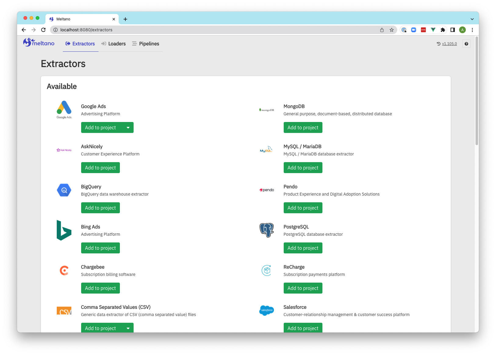
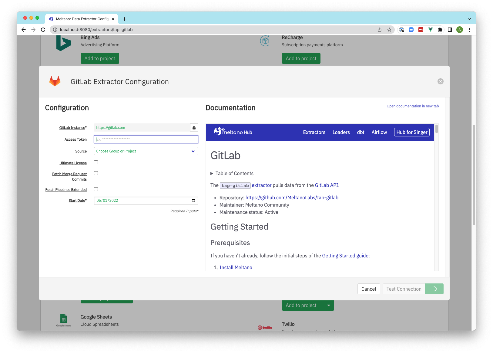
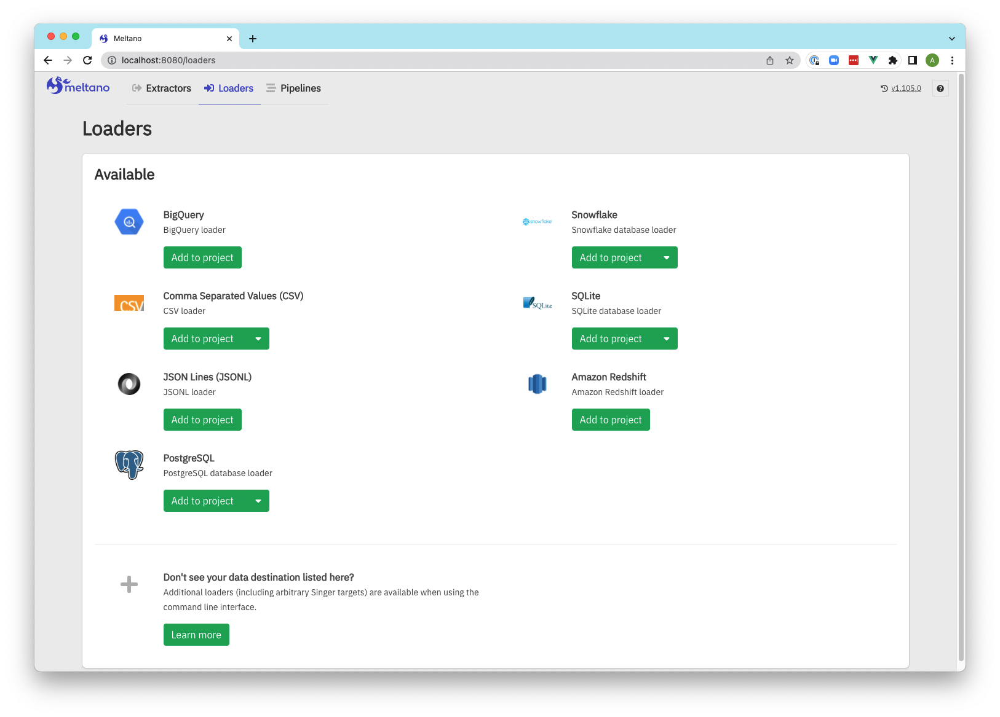
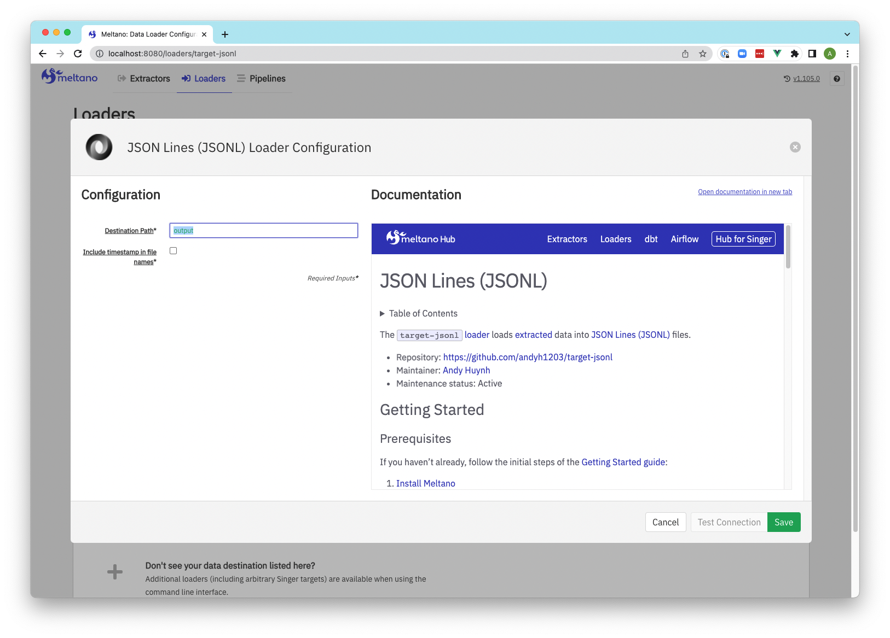
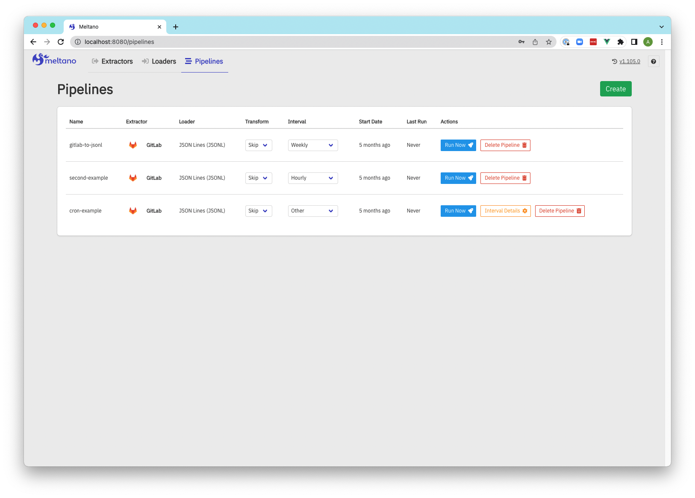
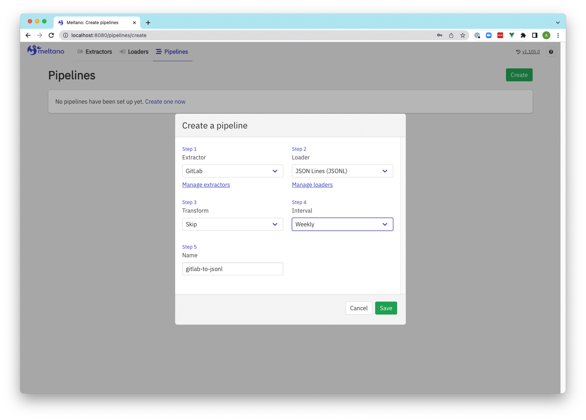
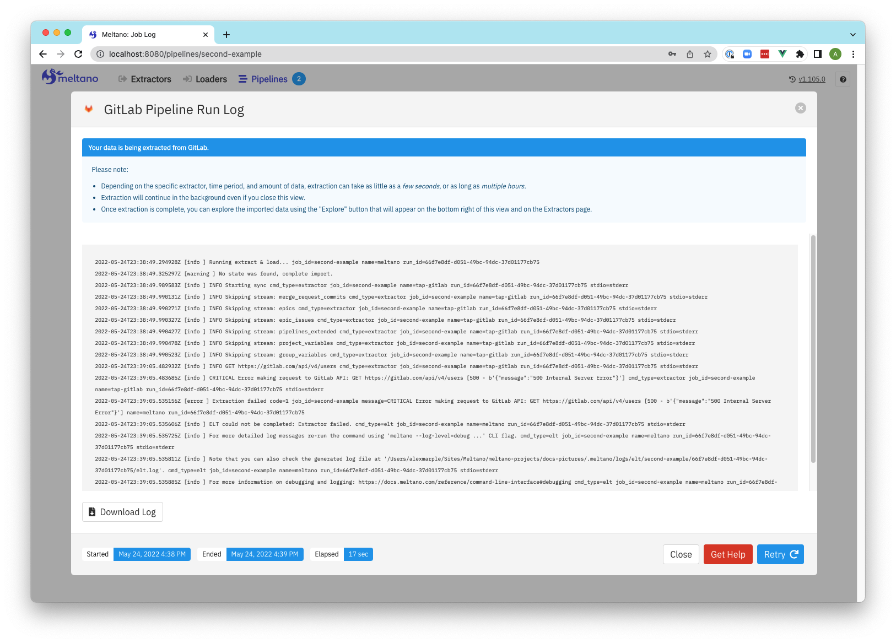
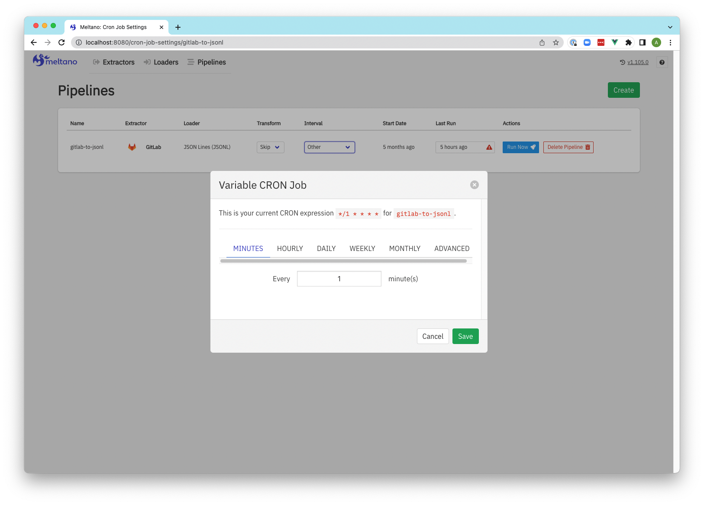

:::caution

  <p>This is an older, hidden page for Meltano UI. The UI is deprecated. Please see our <a href="/guide/troubleshooting#meltano-ui">troubleshooting page</a> for more information.</p>
:::

Meltano is optimized for usage through the [`meltano` CLI](/reference/command-line-interface)
and direct changes to the [`meltano.yml` project file](/concepts/project#meltano-yml-project-file).

However, a web-based UI is also available for when you want to quickly check the
status and most recent logs of your project's [scheduled pipelines](/guide/orchestration),
or if you want to give less technical team members or clients the option to [configure](/guide/configuration) their
extractors, loaders, and pipelines themselves.

Various [settings](/reference/settings) are available that let you [configure the Meltano UI server](/reference/settings#meltano-ui-server), [enable and disable features](/reference/settings#meltano-ui-features), and [customize its appearance](/reference/settings#meltano-ui-customization).

## Current status

Basic functionality around [managing](/guide/plugin-management) and [configuring](/guide/configuration) [plugins](/concepts/plugins) and monitoring [pipelines](/guide/orchestration) is available,
as is an experimental [Analysis](/guide/analysis) feature, but many (newer) features of the CLI do not yet have a UI equivalent.

Missing functionality and other improvements are being tracked in the ["Pipeline management and monitoring UI" epic](https://gitlab.com/groups/meltano/-/epics/78),
and [new issues and contributions](/contribute/) from the community are more than welcome,
but the team is not currently [prioritizing](https://handbook.meltano.com/product/roadmap) improvements to the UI because of the heavy focus on the CLI.

## Usage during development

Start the Meltano UI web server using [`meltano ui`](/reference/command-line-interface#ui):

```bash
meltano ui
```

Unless [configured otherwise](/reference/settings#ui-bind-port), the UI will now be available at http://localhost:5000.

### Docker Compose

If you'd like to use [Docker Compose](https://docs.docker.com/compose/) to manage the Meltano UI application lifecycle,
you can add the appropriate `docker-compose.yml` file to your project by adding the
[`docker-compose` file bundle](https://github.com/meltano/files-docker-compose):

```bash
# For these examples to work, ensure that
# Docker Compose has been installed
docker-compose --version

# Add Docker Compose files to your project
meltano add files files-docker-compose

# Start the `meltano-ui` service in the background
docker-compose up -d
```

Unless [configured otherwise](/reference/settings#ui-bind-port), the UI will now be available at http://localhost:5000.

For more details and instructions, refer to [README](https://github.com/meltano/files-docker-compose/blob/main/bundle/README.md) contained in the file bundle.

## Deployment in production

To learn about deploying Meltano UI in production, refer to the ["Meltano UI" section](/guide/production#meltano-ui) of the [Deployment in Production guide](/guide/production).

## Screenshots

### Extractors

[](images/ui/extractors.png)

### Extractor configuration

[](images/ui/extractors-configuration.png)

### Loaders

[](images/ui/loaders.png)

### Loaders configuration

[](images/ui/loaders-configuration.png)

### Pipelines

[](images/ui/pipelines.png)

### Pipeline creation

[](images/ui/create-pipeline.png)

### Pipeline run log

[](images/ui/pipeline-log.png)

### Pipeline update schedule to reflect CRON settings

[](images/ui/pipeline-cron.png)

## Meltano UI server

These settings can be used to configure the [Meltano UI](/reference/ui) server.

[Meltano UI feature settings](#meltano-ui-features) and [customization settings](#meltano-ui-customization) have their own sections.

### <a name="ui-bind-host"></a>`ui.bind_host`

- [Environment variable](/guide/configuration#configuring-settings): `MELTANO_UI_BIND_HOST`
- [`meltano ui`](/reference/command-line-interface#ui) CLI option: `--bind`
- Default: `0.0.0.0`

The host to bind to.

Together with the [`ui.bind_port` setting](#ui-bind-port), this setting corresponds to
[Gunicorn's `bind` setting](https://docs.gunicorn.org/en/stable/settings.html#bind).

#### How to use

```bash
meltano config meltano set ui bind_host 127.0.0.1

export MELTANO_UI_BIND_HOST=127.0.0.1

meltano ui --bind=127.0.0.1
```

### <a name="ui-bind-port"></a>`ui.bind_port`

- [Environment variable](/guide/configuration#configuring-settings): `MELTANO_UI_BIND_PORT`
- [`meltano ui`](/reference/command-line-interface#ui) CLI option: `--bind-port`
- Default: `5000`

The port to bind to.

Together with the [`ui.bind_host` setting](#ui-bind-host), this setting corresponds to
[Gunicorn's `bind` setting](https://docs.gunicorn.org/en/stable/settings.html#bind).

#### How to use

```bash
meltano config meltano set ui bind_port 80

export MELTANO_UI_BIND_PORT=80

meltano ui --bind-port=80
```

### <a name="ui-server-name"></a>`ui.server_name`

- [Environment variable](/guide/configuration#configuring-settings): `MELTANO_UI_SERVER_NAME`
- Default: None

The host and port Meltano UI is available at, e.g. `<host>:<port>`.

The port will usually match the [`ui.bind_port` setting](#ui-bind-port), and can be omitted when the default port for HTTP (`80`) or HTTPS (`443`) is used.

Unless the [`ui.session_cookie_domain` setting](#ui-session-cookie-domain) is set, this setting will be used as the session cookie domain.

If the [`ui.notification` setting](#ui-notification) is enabled, this setting will be used to generate external URLs in notification emails.

When set, Meltano UI will only respond to requests whose hostname (`Host` header) matches this setting.
If this is undesirable, you can set the [`ui.session_cookie_domain` setting](#ui-session-cookie-domain) instead.
This may be the case when Meltano UI is situated behind a load balancer performing health checks without specifying a hostname.

If the [`ui.authentication` setting](#ui-authentication) is enabled,
[`meltano ui`](/reference/command-line-interface#ui) will print a
security warning if neither this setting or the [`ui.session_cookie_domain` setting](#ui-session-cookie-domain) has been set.

This setting corresponds to [Flask's `SERVER_NAME` setting](https://flask.palletsprojects.com/en/1.1.x/config/#SERVER_NAME).

#### How to use

```bash
meltano config meltano set ui server_name meltano.example.com

export MELTANO_UI_SERVER_NAME=meltano.example.com
```

[`meltano ui setup <server_name>`](/reference/command-line-interface#setup) can be
used to generate secrets for the [`ui.secret_key`](#ui-secret-key) and
[`ui.password_salt`](#ui-password-salt) settings, that will be stored in a
your project's [`.env` file](/concepts/project#env) along with the specified `server_name`.

```bash
meltano ui setup meltano.example.com
```

### <a name="ui-session-cookie-domain"></a>`ui.session_cookie_domain`

- [Environment variable](/guide/configuration#configuring-settings): `MELTANO_UI_SESSION_COOKIE_DOMAIN`
- Default: None

The domain match rule that the session cookie will be valid for.

If not set, the cookie will be valid for all subdomains of the configured [`ui.server_name`](#ui-server-name).

If the [`ui.authentication` setting](#ui-authentication) is enabled,
[`meltano ui`](/reference/command-line-interface#ui) will print a
security warning if neither this setting or the [`ui.server_name` setting](#ui-server-name) has been set.

This setting corresponds to [Flask's `SESSION_COOKIE_DOMAIN` setting](https://flask.palletsprojects.com/en/1.1.x/config/#SESSION_COOKIE_DOMAIN).

#### How to use

```bash
meltano config meltano set ui session_cookie_domain meltano.example.com

export MELTANO_UI_SESSION_COOKIE_DOMAIN=meltano.example.com
```

### <a name="ui-session-cookie-secure"></a>`ui.session_cookie_secure`

- [Environment variable](/guide/configuration#configuring-settings): `MELTANO_UI_SESSION_COOKIE_SECURE`
- Default: `false`

Enable the `Secure` flag on the session cookie, so that the client will only send it to the server in HTTPS requests.

The application must be served over HTTPS for this to make sense.

This setting corresponds to [Flask's `SESSION_COOKIE_SECURE` setting](https://flask.palletsprojects.com/en/1.1.x/config/#SESSION_COOKIE_SECURE).

#### How to use

```bash
meltano config meltano set ui session_cookie_secure true

export MELTANO_UI_SESSION_COOKIE_SECURE=true
```

### <a name="ui-secret-key"></a>`ui.secret_key`

- [Environment variable](/guide/configuration#configuring-settings): `MELTANO_UI_SECRET_KEY`
- Default: `thisisnotapropersecretkey`

A secret key that will be used for securely signing the session cookie.

If the [`ui.authentication` setting](#ui-authentication) is enabled,
[`meltano ui`](/reference/command-line-interface#ui) will print a
security warning if this setting has not been changed from the default.

This setting corresponds to [Flask's `SECRET_KEY` setting](https://flask.palletsprojects.com/en/1.1.x/config/#SECRET_KEY).

#### How to use

```bash
meltano config meltano set ui secret_key <randomly-generated-secret>

export MELTANO_UI_SECRET_KEY=<randomly-generated-secret>
```

[`meltano ui setup <server_name>`](/reference/command-line-interface#setup) can be
used to generate secrets for the this setting and [`ui.password_salt`](#ui-password-salt),
that will be stored in your project's [`.env` file](/concepts/project#env)
along with the specified [`ui.server_name`](#ui-server-name).

```bash
meltano ui setup meltano.example.com
```

### <a name="ui-password-salt"></a>`ui.password_salt`

- [Environment variable](/guide/configuration#configuring-settings): `MELTANO_UI_PASSWORD_SALT`
- Default: `b4c124932584ad6e69f2774a0ae5c138`

The HMAC salt to use when hashing passwords.

If the [`ui.authentication` setting](#ui-authentication) is enabled,
[`meltano ui`](/reference/command-line-interface#ui) will print a
security warning if this setting has not been changed from the default.

This setting corresponds to [Flask-Security's `SECURITY_PASSWORD_SALT` setting](https://pythonhosted.org/Flask-Security/configuration.html).

#### How to use

```bash
meltano config meltano set ui password_salt <randomly-generated-secret>

export MELTANO_UI_PASSWORD_SALT=<randomly-generated-secret>
```

[`meltano ui setup <server_name>`](/reference/command-line-interface#setup) can be
used to generate secrets for the this setting and [`ui.secret_key`](#ui-secret-key),
that will be stored in your project's [`.env` file](/concepts/project#env)
along with the specified [`ui.server_name`](#ui-server-name).

```bash
meltano ui setup meltano.example.com
```

### `ui.workers`

- [Environment variable](/guide/configuration#configuring-settings): `MELTANO_UI_WORKERS`
- Default: `4`

The number of worker processes `meltano ui` will use to handle requests.

This setting corresponds to [Gunicorn's `workers` setting](https://docs.gunicorn.org/en/stable/settings.html#workers).

#### How to use

```bash
meltano config meltano set ui workers 1

export MELTANO_UI_WORKERS=1
```

### <a name="ui-forwarded-allow-ips"></a>`ui.forwarded_allow_ips`

- [Environment variable](/guide/configuration#configuring-settings): `MELTANO_UI_FORWARDED_ALLOW_IPS`
- Default: `127.0.0.1`

Comma-separated front-end (reverse) proxy IPs that are allowed to set secure headers to indicate HTTPS requests.

Set to `*` to disable checking of front-end IPs, which can be useful for setups where you don't know in advance the IP address of front-end, but you still trust the environment.

This setting corresponds to [Gunicorn's `forwarded_allow_ips` setting](https://docs.gunicorn.org/en/stable/settings.html#forwarded-allow-ips).

#### How to use

```bash
meltano config meltano set ui forwarded_allow_ips "*"

export MELTANO_UI_FORWARDED_ALLOW_IPS="*"
```

## Meltano UI features

These settings can be used to enable certain features of [Meltano UI](/reference/ui).

[Meltano UI server settings](#meltano-ui-server) and [customization settings](#meltano-ui-customization) have their own sectionss

### <a name="ui-readonly"></a>`ui.readonly`

- [Environment variable](/guide/configuration#configuring-settings): `MELTANO_UI_READONLY`
- Default: `false`

To block all write actions in the Meltano UI, you can run it in in _read-only_ mode.

If you're enabling the [`ui.authentication` setting](#ui-authentication) and would
like to only use read-only mode for anonymous users, enable the [`ui.anonymous_readonly` setting](#ui-anonymous-readonly) instead.

This setting differs from the [`project_readonly` setting](#project-readonly) in two ways:

1. it also blocks write actions in the UI that do not modify project files, like storing settings in the [system database](/concepts/project#system-database), and
2. it does not affect the [CLI](/reference/command-line-interface).

#### How to use

```bash
meltano config meltano set ui readonly true

export MELTANO_UI_READONLY=true
```

### <a name="ui-authentication"></a>`ui.authentication`

- [Environment variable](/guide/configuration#configuring-settings): `MELTANO_UI_AUTHENTICATION`
- Default: `false`

Use this setting to enable authentication and disallow anonymous usage of your Meltano instance.

Additionally, you will need to:

1. Ensure your configuration is secure by setting the [`ui.secret_key`](#ui-secret-key) and [`ui.password_salt`](#ui-password-salt) settings, as well as [`ui.server_name`](#ui-server-name) or [`ui.session_cookie_domain`](#ui-session-cookie-domain), manually or using [`meltano ui setup <server_name>`](./command-line-interface#setup).

2. Create at least one user using [`meltano user add`](./command-line-interface#user).

#### How to use

```bash
meltano config meltano set ui authentication true

export MELTANO_UI_AUTHENTICATION=true
```

### <a name="ui-anonymous-readonly"></a>`ui.anonymous_readonly`

- [Environment variable](/guide/configuration#configuring-settings): `MELTANO_UI_ANONYMOUS_READONLY`
- Default: `false`

When the [`ui.authentication` setting](#ui-authentication) is enabled,
enabling this setting will allow anonymous users read-only access to Meltano UI.
Once a user is authenticated, write actions will be available again.

This setting is especially useful when setting up a publicly available demo
instance of Meltano UI for anonymous users to interact with.
These users will not be able to make any changes, but admins will once they sign in.

#### How to use

```bash
meltano config meltano set ui anonymous_readonly true

export MELTANO_UI_ANONYMOUS_READONLY=true
```

### <a name="ui-notification"></a>`ui.notification`

- [Environment variable](/guide/configuration#configuring-settings): `MELTANO_UI_NOTIFICATION`
- Default: `false`

Meltano can send email notifications upon certain events.

Your outgoing mail server can be configured using the [`mail.*` settings](#mail-server) below.

:::info

  <p>To ease the development and testing, Meltano is preconfigured to use a local <a href="https://github.com/mailhog">MailHog</a> instance to trap all the outgoing emails.</p>
  <p>Use the following docker command to start it:</p>
<pre>
docker run --rm -p 1025:1025 -p 8025:8025 --name mailhog mailhog/mailhog
</pre>
  <p>All emails sent by Meltano should now be available at <code>http://localhost:8025/</code></p>
:::

#### How to use

```bash
meltano config meltano set ui notification true

export MELTANO_UI_NOTIFICATION=true
```

## Meltano UI customization

These settings can be used to customize certain aspects of [Meltano UI](/reference/ui).

[Meltano UI server settings](#meltano-ui-server) and [feature settings](#meltano-ui-features) have their own sections.

### `ui.logo_url`

- [Environment variable](/guide/configuration#configuring-settings): `MELTANO_UI_LOGO_URL`
- Default: None

Customize the logo used by Meltano UI in the navigation bar and on the sign-in page (when the [`ui.authentication` setting](#ui-authentication) is enabled).

#### How to use

```bash
meltano config meltano set ui logo_url https://meltano.com/meltano-logo-with-text.svg

export MELTANO_UI_LOGO_URL=https://meltano.com/meltano-logo-with-text.svg
```

## Mail server

Meltano uses [Flask-Mail](https://pythonhosted.org/Flask-Mail/) to send emails. Take a look at the documentation to properly configure your outgoing email server.

### `mail.server`

- [Environment variable](/guide/configuration#configuring-settings): `MELTANO_MAIL_SERVER`
- Default: `localhost`

```bash
meltano config meltano set mail server smtp.example.com
export MELTANO_MAIL_SERVER=smtp.example.com
```

### `mail.port`

- [Environment variable](/guide/configuration#configuring-settings): `MELTANO_MAIL_PORT`
- Default: `1025`

```bash
meltano config meltano set mail port 25
export MELTANO_MAIL_PORT=25
```

### `mail.default_sender`

- [Environment variable](/guide/configuration#configuring-settings): `MELTANO_MAIL_DEFAULT_SENDER`
- Default: `"Meltano" <bot@meltano.com>`

```bash
meltano config meltano set mail default_sender '"Example Meltano" <bot@meltano.example.com>'
export MELTANO_MAIL_DEFAULT_SENDER='"Example Meltano" <bot@meltano.example.com>'
```

### `mail.use_tls`

- [Environment variable](/guide/configuration#configuring-settings): `MELTANO_MAIL_USE_TLS`
- Default: `false`

```bash
meltano config meltano set mail use_tls true
export MELTANO_MAIL_USE_TLS=true
```

### `mail.username`

- [Environment variable](/guide/configuration#configuring-settings): `MELTANO_MAIL_USERNAME`
- Default: None

```bash
meltano config meltano set mail username meltano
export MELTANO_MAIL_USERNAME=meltano
```

### `mail.password`

- [Environment variable](/guide/configuration#configuring-settings): `MELTANO_MAIL_PASSWORD`
- Default: None

```bash
meltano config meltano set mail password meltano
export MELTANO_MAIL_PASSWORD=meltano
```

### `mail.debug`

- [Environment variable](/guide/configuration#configuring-settings): `MELTANO_MAIL_DEBUG`
- Default: `false`

```bash
meltano config meltano set mail debug true
export MELTANO_MAIL_DEBUG=true
```

### `mail.sendgrid_unsubscribe_group_id`

If you are using the SendGrid SMTP API you may optionally set the [SendGrid unsubscribe group ID](https://docs.sendgrid.com/ui/sending-email/unsubscribe-groups).

- [Environment variable](/guide/configuration#configuring-settings): `MELTANO_MAIL_SENDGRID_UNSUBSCRIBE_GROUP_ID`
- Default: `12751`

```bash
meltano config meltano set mail sendgrid_unsubscribe_group_id 42
export MELTANO_MAIL_SENDGRID_UNSUBSCRIBE_GROUP_ID=42
```

## OAuth Service

Meltano ships with an OAuth Service to handle the OAuth flow in the Extractors' configuration.

:::caution

  <p>To run this service, you **must** have a registered OAuth application on the [Authorization server](https://www.oauth.com/oauth2-servers/definitions/#the-authorization-server).</p>
  <p>Most importantly, the Redirect URI must be set properly so that the OAuth flow can be completed.</p>
  <p>This process is specific to each Provider.</p>
:::

The OAuth Service is bundled within Meltano, and is automatically started with [`meltano ui`](/reference/command-line-interface#ui) and mounted at `/-/oauth` for development purposes.

As it is a Flask application, it can also be run as a standalone using:

```bash
FLASK_ENV=production FLASK_APP=meltano.oauth python -m flask run --port 9999
```

### `oauth_service.url`

- [Environment variable](/guide/configuration#configuring-settings): `MELTANO_OAUTH_SERVICE_URL`
- Default: None

The local OAuth service for development purposes is available at `/-/oauth`.

#### How to use

```bash
meltano config meltano set oauth_service url https://oauth.svc.meltanodata.com
export MELTANO_OAUTH_SERVICE_URL=https://oauth.svc.meltanodata.com
```

### `oauth_service.providers`

- [Environment variable](/guide/configuration#configuring-settings): `MELTANO_OAUTH_SERVICE_PROVIDERS`
- Default: `all`

To enable specific providers, use comma-separated `oauth.provider` names from `discovery.yml`. To enable all providers, use `all`.

#### How to use

```bash
meltano config meltano set oauth_service providers facebook,google_adwords
export MELTANO_OAUTH_SERVICE_PROVIDERS=facebook,google_adwords
```

### `oauth_service.facebook.client_id`

- [Environment variable](/guide/configuration#configuring-settings): `OAUTH_FACEBOOK_CLIENT_ID`
- Default: None

```bash
meltano config meltano set oauth_service facebook client_id <facebook-client-id>
export OAUTH_FACEBOOK_CLIENT_ID=<facebook-client-id>
```

### `oauth_service.facebook.client_secret`

- [Environment variable](/guide/configuration#configuring-settings): `OAUTH_FACEBOOK_CLIENT_SECRET`
- Default: None

```bash
meltano config meltano set oauth_service facebook client_secret <facebook-client-secret>
export OAUTH_FACEBOOK_CLIENT_SECRET=<facebook-client-secret>
```

### `oauth_service.google_adwords.client_id`

- [Environment variable](/guide/configuration#configuring-settings): `OAUTH_GOOGLE_ADWORDS_CLIENT_ID`
- Default: None

```bash
meltano config meltano set oauth_service google_adwords client_id <google-adwords-client-id>
export OAUTH_GOOGLE_ADWORDS_CLIENT_ID=<google-adwords-client-id>
```

### `oauth_service.google_adwords.client_secret`

- [Environment variable](/guide/configuration#configuring-settings): `OAUTH_GOOGLE_ADWORDS_CLIENT_SECRET`
- Default: None

```bash
meltano config meltano set oauth_service google_adwords client_secret <google-adwords-client-secret>
export OAUTH_GOOGLE_ADWORDS_CLIENT_SECRET=<google-adwords-client-secret>
```

## OAuth Single-Sign-On

These variables are specific to [Flask-OAuthlib](https://flask-oauthlib.readthedocs.io/en/latest/#) and work with [OAuth authentication with GitLab](https://docs.gitlab.com/ee/integration/oauth_provider.html).

:::info

  <p>These settings are used for single-sign-on using an external OAuth provider.</p>
:::

For more information on how to get these from your GitLab application, check out the [integration docs from GitLab](https://docs.gitlab.com/ee/integration/gitlab.html).

### `oauth.gitlab.client_id`

- [Environment variable](/guide/configuration#configuring-settings): `OAUTH_GITLAB_CLIENT_ID`, alias: `OAUTH_GITLAB_APPLICATION_ID`
- Default: None

```bash
meltano config meltano set oauth gitlab client_id <gitlab-client-id>
export OAUTH_GITLAB_CLIENT_ID=<gitlab-client-id>
export OAUTH_GITLAB_APPLICATION_ID=<gitlab-client-id>
```

### `oauth.gitlab.client_secret`

- [Environment variable](/guide/configuration#configuring-settings): `OAUTH_GITLAB_CLIENT_SECRET`, alias: `OAUTH_GITLAB_SECRET`
- Default: None

```bash
meltano config meltano set oauth gitlab client_secret <gitlab-client-secret>
export OAUTH_GITLAB_CLIENT_SECRET=<gitlab-client-secret>
export OAUTH_GITLAB_SECRET=<gitlab-client-secret>
```

## CLI

### `ui`

- `meltano ui`: Start the Meltano UI.

#### `start` (default)

Start the Meltano UI.

#### `setup`

:::info

  <p>This command is only relevant for production-grade setup.</p>
:::

Generate secrets for the [`ui.secret_key`](/reference/settings#ui-secret-key)
and [`ui.password_salt`](/reference/settings#ui-password-salt) settings, that
will be stored in your project's [`.env` file](/concepts/project#env) along with the
specified value for the [`ui.server_name` setting](/reference/settings#ui-server-name).

In production, you will likely want to move these settings to actual environment variables, since `.env` is in `.gitignore` by default.

:::danger

  <p><strong>Regenerating secrets will cause the following:</strong></p>
  <p>
    <ul>
      <li>All passwords will be invalid</li>
      <li>All sessions will be expired</li>
    </ul>
  </p>
  <p>Use with caution!</p>
:::

##### How to use

The `--bits` flag can be used to specify the size of the secrets, default to 256.

```bash
# Format
meltano ui setup [--bits=256] <server_name>

meltano ui setup meltano.example.com
```

#### Using `ui` with Environments

The `ui` command does not run relative to a [Meltano Environment](https://docs.meltano.com/concepts/environments). The `--environment` flag and [`default_environment` setting](https://docs.meltano.com/concepts/environments#default-environments) in your `meltano.yml` file will be ignored if set.

## Contributing Docs

## UI Development

In the event you are contributing to Meltano UI and want to work with all of the frontend tooling (i.e., hot module reloading, etc.), you will need to run the following commands:

```bash
# Activate your poetry created virtual environment if needed.
# If you manage your virtualenv activation through other means you can omit this command.
poetry shell
# Create a new Meltano project
meltano init $PROJECT_DIRECTORY
# Change directory into your newly created project
cd $PROJECT_DIRECTORY
# Start the Meltano API and a production build of Meltano UI that you can ignore
meltano ui
# Open a new terminal tab and go to the directory you cloned meltano into
cd $WHEREVER_YOU_CLONED_MELTANO/src/webapp
# Install frontend infrastructure at the root directory
yarn
# Start local development environment
yarn serve
```

The development build of the Meltano UI will now be available at http://localhost:8080/.

A production build of the API will be available at http://localhost:5000/ to support the UI, but you will not need to interact with this directly. However, as mentioned in the [API Development section](/contribute/api) above, users on MacOS may need to specify an alternate [bind to port](/reference/settings#ui-bind-port) to prevent a port conflict with a MacOS system service also running on port 5000.

:::caution

  <p><strong>If you're developing for the _Embed_ app (embeddable <code>iframe</code> for reports) you can toggle <code>MELTANO_EMBED</code>:</strong></p>

```
# Develop for the embed app
export MELTANO_EMBED=1

# Develop for the main app (this is the default)
export MELTANO_EMBED=0

# Start local development environment
yarn serve
```

:::

If you need to change the URL of your development environment, you can do this by updating your project's `.env` file with the following configuration:

```bash
# The URL where the web app will be located when working locally in development
# since it provides the redirect after authentication.
# Not require for production
export MELTANO_UI_URL = ""
```

## UI/UX

### Visual Hierarchy

#### Depth

The below level hierarchy defines the back to front depth sorting of UI elements. Use it as a mental model to inform your UI decisions.

- Level 1 - Primary navigation, sub-navigation, and signage - _Grey_
- Level 2 - Primary task container(s) - _White w/Shadow_
- Level 3 - Dropdowns, dialogs, pop-overs, etc. - _White w/Shadow_
- Level 4 - Modals - _White w/Lightbox_
- Level 5 - Toasts - _White w/Shadow + Message Color_

#### Interactivity

Within each aforementioned depth level is an interactive color hierarchy that further organizes content while communicating an order of importance for interactive elements. This interactive color hierarchy subtly influences the user's attention and nudges their focus.

1. Primary - _`$interactive-primary`_
   - Core interactive elements (typically buttons) for achieving the primary task(s) in the UI
   - Fill - Most important
   - Stroke - Important
1. Secondary - _`$interactive-secondary`_
   - Supporting interactive elements (various controls) that assist the primary task(s) in the UI
   - Fill - Most important
     - Can be used for selected state (typically delegated to stroke) for grouped buttons (examples usage seen in Transform defaults)
   - Stroke - Important
     - Denotes the states of selected, active, and/or valid where grey represents the opposites unselected, inactive, and/or invalid
1. Tertiary - _Greyscale_
   - Typically white buttons and other useful controls that aren't core or are in support of the primary task(s) in the UI
1. Navigation - _`$interactive-navigation`_
   - Denotes navigation and sub-navigation interactive elements as distinct from primary and secondary task colors

After the primary, secondary, tertiary, or navigation decision is made, the button size decision is informed by:

1. Use the default button size
1. Use the `is-small` modifier if it is within a component that can have multiple instances

### Markup Hierarchy

There are three fundamental markup groups in the codebase. All three are technically VueJS single-file components but each have an intended use:

1. Views (top-level "pages" and "page containers" that map to parent routes)
2. Sub-views (nested "pages" of "page containers" that map to child routes)
3. Components (widgets that are potentially reusable across parent and child routes)

Here is a technical breakdown:

1. Views - navigation, signage, and sub-navigation
   - Navigation and breadcrumbs are adjacent to the main view
   - Use `<router-view-layout>` as root with only one child for the main view:
     1. `<div class="container view-body">`
        - Can expand based on task real-estate requirements via `is-fluid` class addition
   - Reside in the `src/views` directory
2. Sub-views - tasks
   - Use `<section>` as root (naturally assumes a parent of `<div class="container view-body">`) with one type of child:
     - One or more `<div class="columns">` each with their needed `<div class="column">` variations
   - Reside in feature directory (ex. `src/components/analyze/AnalyzeModels`)
3. Components - task helpers
   - Use Vue component best practices
   - Reside in feature or generic directory (ex. `src/components/analyze/ResultTable` and `src/components/generic/Dropdown`)
