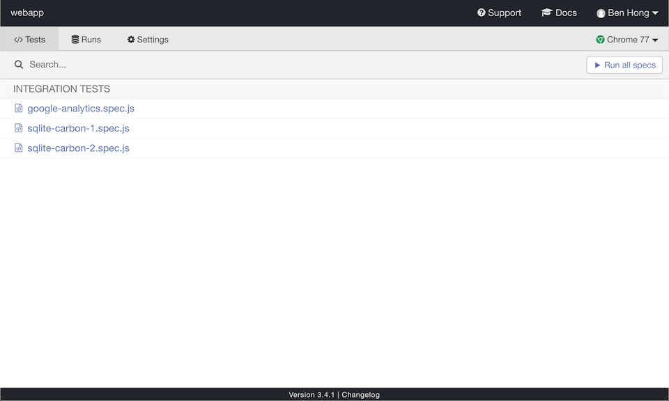

## Prerequisites

In order to contribute to Meltano, you will need the following:

1. [Python 3.7+](https://www.python.org/downloads/). For more details about Python requirements, refer to the ["Requirements" section](/getting-started/installation#requirements) of the Installation instructions, that also apply here.
2. [Node 8.11.0+](https://nodejs.org/)
3. [Yarn](https://yarnpkg.com/)

## Setting Up Your Environment

```bash
# Clone the Meltano repo
git clone git@github.com:meltano/meltano.git

# Change directory into the Meltano project
cd meltano

# Install the Poetry tool for managing dependencies and packaging
pip3 install poetry

# Install all the dependencies
poetry install

# Install the pre-commit hook
poetry run pre-commit install --install-hooks

# Obtain a shell in the poetry created virtual environment
poetry shell
```

Meltano is now installed and available at `meltano`, as long as you remain in your virtual environment that you access
via `poetry shell`! Most editor's like [VSCode](https://code.visualstudio.com/) or [PyCharm](https://www.jetbrains.com/pycharm/)
can also be configured to detect and make use of virtualenv's, or even be configured to use poetry directly. That allows
meltano commands to work as you expect in editor based terminals, and is also typically required to enable advanced
editors features (debugging, code hints, etc).

You can also run meltano outside of an activated virtualenv by prefixing all commands with `poetry run` , e.g.
`poetry run meltano...`.

Note that for users who are using pyenv with the [virtualenv plugin](https://github.com/pyenv/pyenv-virtualenv) you will
likely not need to prefix the commands with `poetry` as poetry will default to using the pyenv activated virtual
environment.

This means that you're ready to start Meltano CLI development. For API development, read on.

<div class="notification is-warning">
  <p><strong>Metrics (anonymous usage data) tracking</strong></p>
  <p>As you contribute to Meltano, you may want to disable <a href="/reference/settings#send-anonymous-usage-stats">metrics tracking</a> globally rather than by project. You can do this by setting the environment variable `MELTANO_SEND_ANONYMOUS_USAGE_STATS` to `False`:</p>
<pre>
# Add to `~/.bashrc`, `~/.zshrc`, etc, depending on the shell you use:
export MELTANO_SEND_ANONYMOUS_USAGE_STATS=False
</pre>
</div>

## System Database

Meltano API and CLI are both supported by a database that is managed using Alembic migrations.

<div class="notification is-warning">
  <p><strong><a href="https://alembic.sqlalchemy.org/en/latest/">Alembic</a> is a full featured database migration working on top of SQLAlchemy.</strong></p>
</div>

Migrations for the system database are located inside the `meltano.migrations` module.

To create a new migration, use the `alembic revision -m "message"` command, then edit the created file with the necessary database changes. Make sure to implement both `upgrade` and `downgrade`, so the migration is reversible, as this will be used in migration tests in the future.

Each migration should be isolated from the `meltano` module, so **don't import any model definition inside a migration**.

<div class="notification is-danger">
  <p><strong>Meltano doesn't currently support auto-generating migration from the models definition.</strong></p>
  <p></p>
</div>

To run the migrations, use `meltano upgrade` inside a Meltano project.

## Testing

### End-to-End Testing with Cypress

Our end-to-end tests are currently being built with [Cypress](https://www.cypress.io/).

#### How to Run Tests

1. Initialize a new meltano project with `meltano init $PROJECT_DIRECTORY`
1. Change directory into `$PROJECT_DIRECTORY`
1. Clone Meltano repo
1. Open Meltano repo in Terminal
1. Run `yarn setup`
1. Run `yarn test:e2e`

This will kick off a Cypress application that will allow you to run tests as desired by clicking each test suite (which can be found in `/src/tests/e2e/specs/*.spec.js`)



<div class="notification is-info">
  <p><strong>In the near future, all tests can flow automatically; but there are some complications that require manual triggering due to an inability to read pipeline completion.</strong></p>
  <p></p>
</div>

## Resources

- [Managing Multiple Python Versions With pyenv](https://realpython.com/intro-to-pyenv/)
- [Managing environments with poetry](https://python-poetry.org/docs/managing-environments/)
- [Tmux Cheat Sheet & Quick Reference](https://tmuxcheatsheet.com/)

[accepting pull requests]: https://github.com/meltano/meltano/labels/accepting%20pull%20requests
