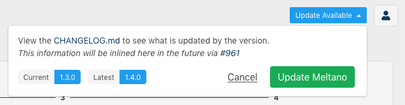

If the installation instructions in the [Getting Started guide](/getting-started#install-meltano) did not work on your environment, or if you'd like to learn more about how to manage your Meltano installation, you've come to the right place.

<div class="notification is-warning">
    <p><strong>Short on time, or just curious what the fuss is about?</strong></p>
    <p>To get a sense of the Meltano experience in just a few minutes, watch the <a href="https://meltano.com/blog/speedrun-from-0-to-elt-in-90-seconds/">"from 0 to ELT in 90 seconds" speedrun</a> that takes you through <a href="/guide/integration">data integration (EL)</a> with the <a href="https://hub.meltano.com/extractors/gitlab.html">tap-gitlab extractor</a> and the <a href="https://hub.meltano.com/loaders/postgres.html">target-postgres loader</a>.</p>
</div>

# Local Installation

In the section below, we will install Meltano locally on your system, so that you can use it [on the command line](/reference/command-line-interface) and [from your browser](/reference/ui).

## Unix-like

For MacOS (Including the M1), Linux Distributions, and more! 

### Requirements

Before you install Meltano, make sure you have the following requirements installed and up to date.

#### Python 3.7, 3.8 or 3.9

<div class="notification is-info">
  <p>You may refer to <a href="https://realpython.com/installing-python/">https://realpython.com/installing-python/</a> for platform specific installation instructions.</p>
</div>

Use the following command to check that you have the correct Python version installed:

```bash
python --version
```

#### Install pipx

`pip` is a package installer that comes automatically with Python 3+.
[pipx](https://pypa.github.io/pipx/) is a wrapper around `pip` which cleanly installs executable python tools (such as Meltano) into their own virtual environments.

```bash
# install pipx and ensure it is on the path
python3 -m pip install --user pipx
python3 -m pipx ensurepath
# Be sure pipx is available on your path
source ~/.bashrc
```

<div class="notification is-info">
  <p>Why use pipx and virtual environments?</p>
  <p>Your local environment may use a different version of Python or other dependencies that are
difficult to manage. The pipx installer automatically creates a virtual environment and provides a
"clean" isolated space without version conflicts or other compatibility issues.</p>
</div>

### Install Meltano

Now that you have [pipx](https://pypa.github.io/pipx/) installed, run the following command to install the Meltano package into its
own pipx-backed virtual environment:

```bash
pipx install meltano
```

Once the installation completes, you can check if it was successful by running:

```bash
meltano --version
```

### Next Steps

Now that you've installed Meltano and its requirements, you can continue setting up your Meltano project by following the [Getting Started guide](/getting-started#create-your-meltano-project).

## Windows

Please note that Windows is not fully supported yet so some features like the UI, and the ELT command may not work yet. 
See the [Meltano on Windows](https://gitlab.com/groups/meltano/-/epics/115) Epic for more information. 

If you'd like all of Meltano's features to work, you can install Meltano inside the [Windows Subsystem for Linux (WSL)](https://docs.microsoft.com/en-us/windows/wsl/about). 
You may also try [installing Meltano on Docker](#installing-on-docker).

### Requirements

Before you install Meltano, make sure you have the following requirements installed and up to date.

#### Python 3.7, 3.8 or 3.9

<div class="notification is-info">
  <p>You may refer to <a href="https://realpython.com/installing-python/">https://realpython.com/installing-python/</a> for platform specific installation instructions.</p>
</div>

Use the following command in PowerShell to check that you have the correct Python version installed:

```powershell
python --version
```

#### Install pipx

`pip` is a package installer that comes automatically with Python 3+.
[pipx](https://pipxproject.github.io/pipx/) is a wrapper around `pip` which cleanly installs executable python tools (such as Meltano) into their own virtual environments.


```powershell
# install pipx and ensure it is on the path
python3 -m pip install --user pipx
python3 -m pipx ensurepath
#Be sure pipx is available on your path
RefreshEnv
```

<div class="notification is-info">
  <p>Why use pipx and virtual environments?</p>
  <p>Your local environment may use a different version of Python or other dependencies that are
difficult to manage. The pipx installer automatically creates a virtual environment and provides a
"clean" isolated space without version conflicts or other compatibility issues.</p>
</div>

### Install Meltano

Now that you have [pipx](https://pipxproject.github.io/pipx) installed, run the following command to install the Meltano package into its
own pipx-backed virtual environment:

```bash
pipx install meltano
```

Once the installation completes, you can check if it was successful by running:

```bash
meltano --version
```

### Next Steps

Now that you've installed Meltano and its requirements, you can continue setting up your Meltano project by following the [Getting Started guide](/getting-started#create-your-meltano-project).

## Docker

[Docker](https://www.docker.com/) is an alternative installation option to [using a virtual environment to run Meltano](#virtual-environment). To use these instructions you will need to [install Docker](https://docs.docker.com/install/) onto your computer and have it running when you execute the commands below.

### Using Pre-built Docker Images

We maintain the [`meltano/meltano`](https://hub.docker.com/r/meltano/meltano) Docker image on DockerHub, which comes with Python and Meltano pre-installed.

To get the latest version of Meltano, pull the `latest` tag. Images for specific versions of Meltano are tagged `v<X.Y.Z>`, e.g. `v1.55.0`.

By default, these images come with a version of Python chosen for a balance of stability and compatibility, currently Python 3.8.
If you'd like to use a different version of Python instead, add a `-python<X.Y>` suffix to the image tag, e.g. `latest-python3.7` and `v1.54.0-python3.7`.

```bash
# download or update to the latest version
docker pull meltano/meltano

# Or choose a specific version of Meltano and/or Python:
# docker pull meltano/meltano:v1.55.0
# docker pull meltano/meltano:latest-python3.7
# docker pull meltano/meltano:v1.55.0-python3.8

# check the currently installed version
docker run meltano/meltano --version
```

### Initialize Your Project

Once you have Docker installed, running, and have pulled the pre-built image you can use Meltano just as you would in our [Getting Started Guide](/getting-started). However, the command line syntax is slightly different. For example, let's create a new Meltano project:

```bash
cd /your/projects/directory

docker run -v "$(pwd)":/projects \
             -w /projects \
             meltano/meltano init yourprojectname
```

Then you can `cd` into your new project:

```bash
cd yourprojectname
```

We can then start the Meltano UI. Since `ui` is the default command, we can omit it.

```bash
docker run -v "$(pwd)":/project \
             -w /project \
             -p 5000:5000 \
             meltano/meltano
```

You can now visit [http://localhost:5000](http://localhost:5000) to access the Meltano UI.

Now that you're successfully running Meltano, you can continue setting up your Meltano project by following the [Getting Started guide](/getting-started).

Note that wherever you are asked to run the `meltano` command, you will want to run it through `docker run` as in the snippet above.


# Troubleshooting Installation

<div class="notification is-info">
  <p>Are you having installation or deployment problems? We are here to help you. Check out <a href="/">Getting Help</a> on the different ways to get in touch with us.</p>
</div>

## Upgrading Meltano Version

We release new versions of Meltano every week. To keep tabs on the latest releases, follow along on the [Meltano blog](https://meltano.com/blog/), or have a look at our [CHANGELOG](https://github.com/meltano/meltano/blob/main/CHANGELOG.md).

## Using the command line

You can update Meltano to the latest version by running the following command in your terminal from inside a Meltano project:

```
meltano upgrade
```

## Using Meltano UI

When an update is available, you will be informed of this automatically through a shiny blue button in the top right corner of Meltano UI:


Clicking this button will show more information and give you the option to install the update right away:



The Meltano UI will refresh automatically once installation is complete.
