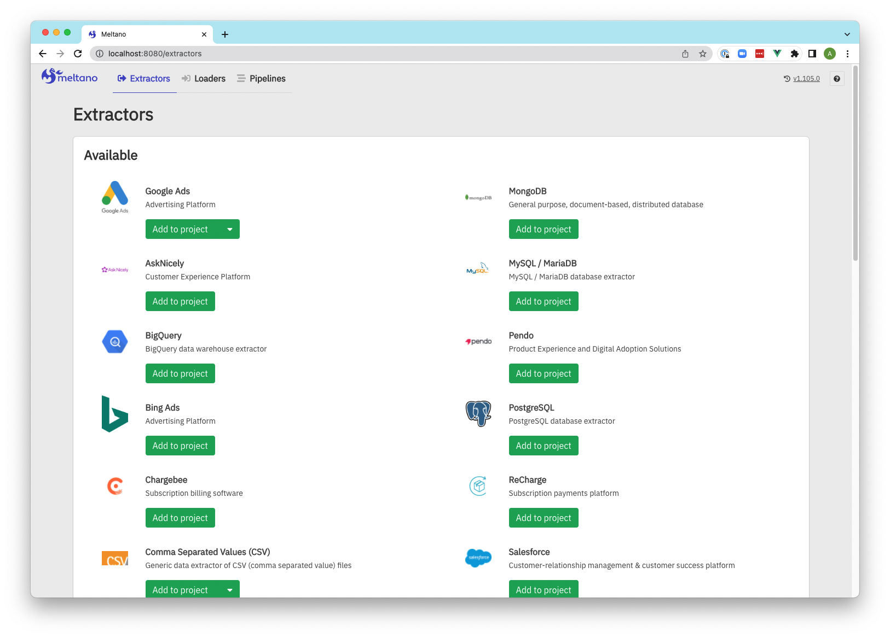
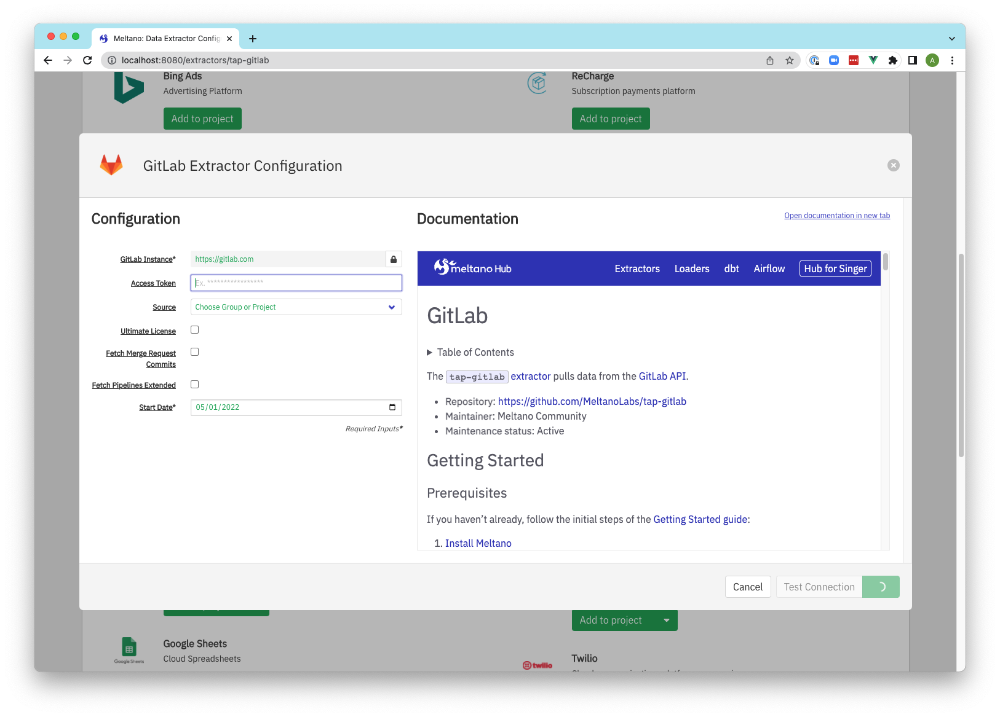
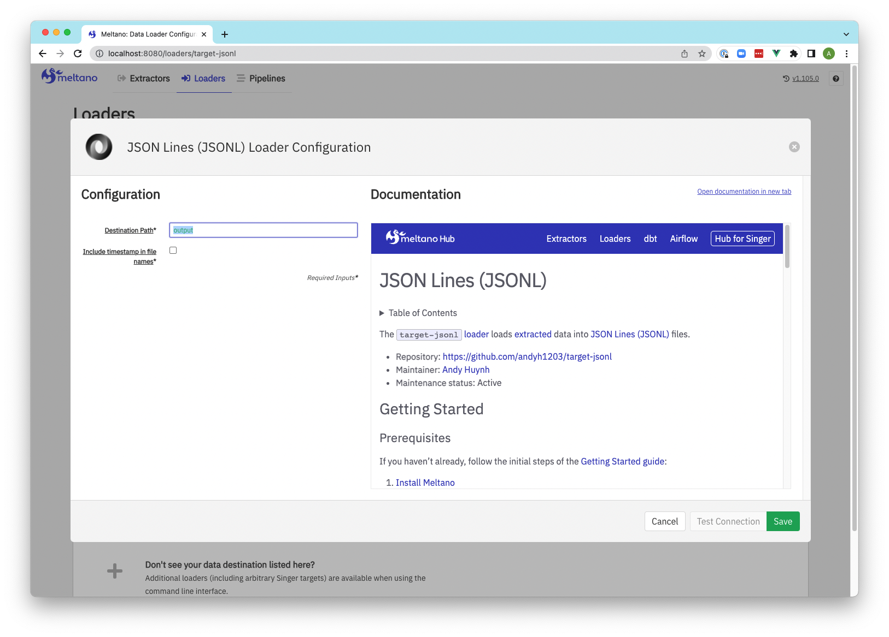
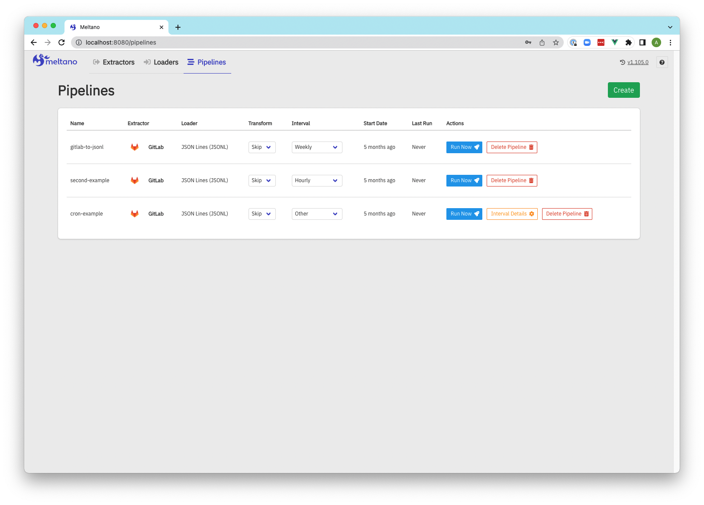
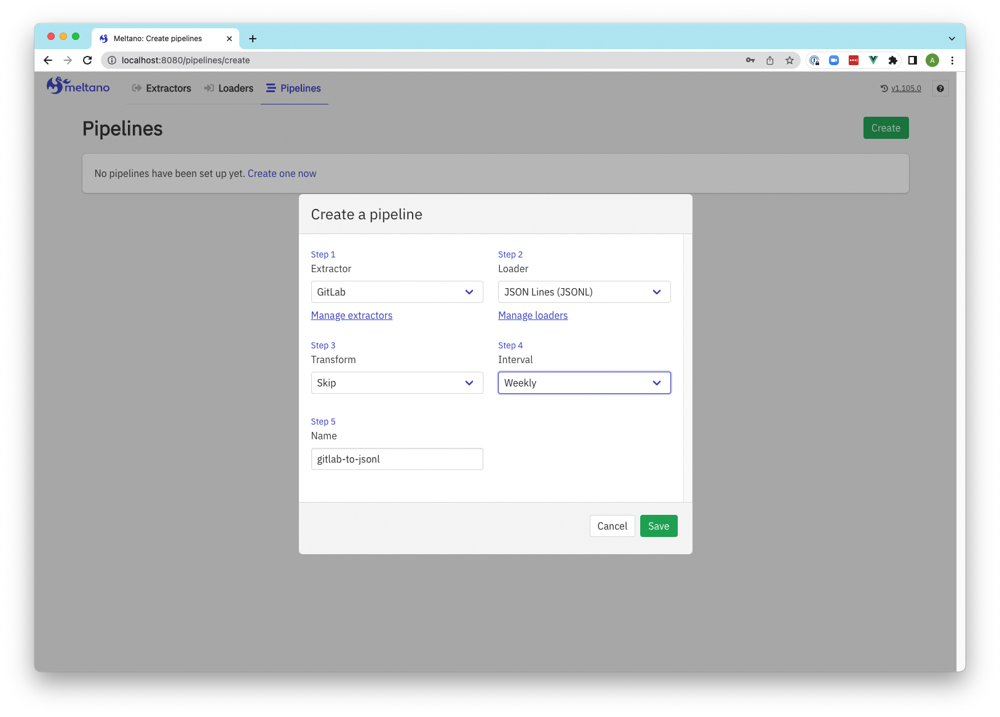
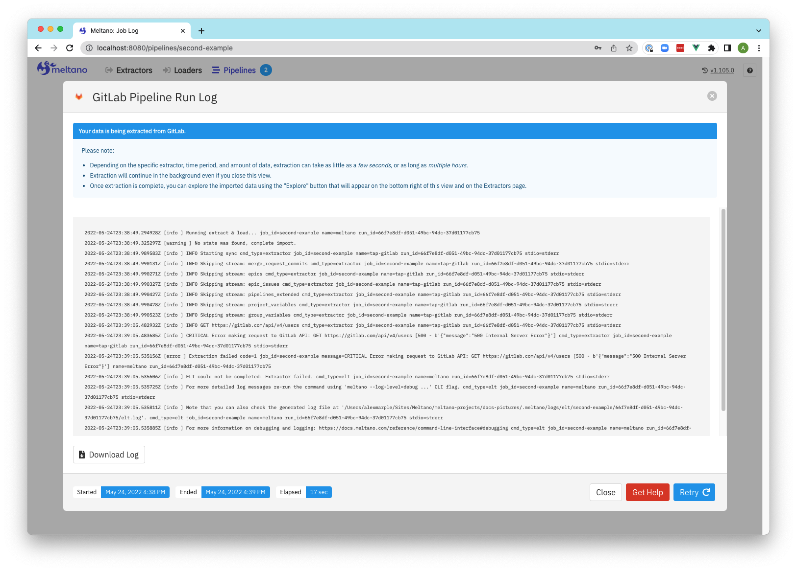
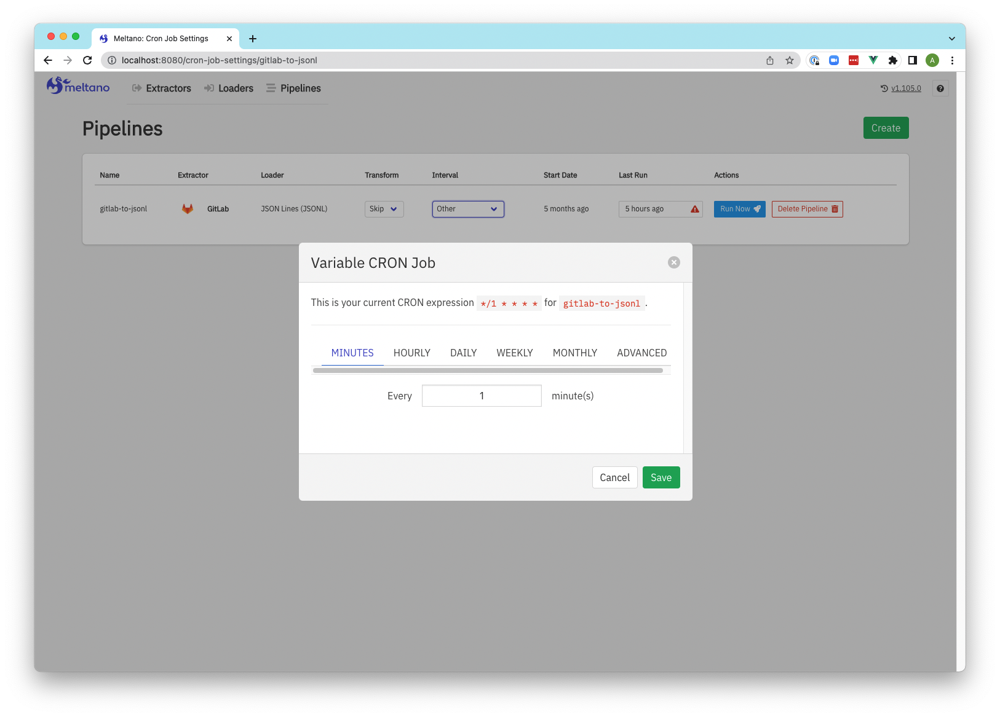

Meltano is optimized for usage through the [`meltano` CLI](/reference/command-line-interface)
and direct changes to the [`meltano.yml` project file](/concepts/project#meltano-yml-project-file).

However, a web-based UI is also available for when you want to quickly check the
status and most recent logs of your project's [scheduled pipelines](/guide/orchestration),
or if you want to give less technical team members or clients the option to [configure](/guide/configuration) their
extractors, loaders, and pipelines themselves.

Various [settings](/reference/settings) are available that let you [configure the Meltano UI server](/reference/settings#meltano-ui-server), [enable and disable features](/reference/settings#meltano-ui-features), and [customize its appearance](/reference/settings#meltano-ui-customization).

## Current status

Basic functionality around [managing](/guide/plugin-management) and [configuring](/guide/configuration) [plugins](/concepts/plugins) and monitoring [pipelines](/guide/orchestration) is available,
as is an experimental [Analysis](/guide/analysis) feature, but many (newer) features of the CLI do not yet have a UI equivalent.

Missing functionality and other improvements are being tracked in the ["Pipeline management and monitoring UI" epic](https://gitlab.com/groups/meltano/-/epics/78),
and [new issues and contributions](/contribute/) from the community are more than welcome,
but the team is not currently [prioritizing](https://handbook.meltano.com/product/roadmap) improvements to the UI because of the heavy focus on the CLI.

## Usage during development

Start the Meltano UI web server using [`meltano ui`](/reference/command-line-interface#ui):

```bash
meltano ui
```

Unless [configured otherwise](/reference/settings#ui-bind-port), the UI will now be available at <http://localhost:5000>.

### Docker Compose

If you'd like to use [Docker Compose](https://docs.docker.com/compose/) to manage the Meltano UI application lifecycle,
you can add the appropriate `docker-compose.yml` file to your project by adding the
[`docker-compose` file bundle](https://github.com/meltano/files-docker-compose):

```bash
# For these examples to work, ensure that
# Docker Compose has been installed
docker-compose --version

# Add Docker Compose files to your project
meltano add files files-docker-compose

# Start the `meltano-ui` service in the background
docker-compose up -d
```

Unless [configured otherwise](/reference/settings#ui-bind-port), the UI will now be available at <http://localhost:5000>.

For more details and instructions, refer to [README](https://github.com/meltano/files-docker-compose/blob/main/bundle/README.md) contained in the file bundle.

## Deployment in production

To learn about deploying Meltano UI in production, refer to the ["Meltano UI" section](/guide/production#meltano-ui) of the [Deployment in Production guide](/guide/production).

## Screenshots

### Extractors

[](images/ui/extractors.png)

### Extractor configuration

[](images/ui/extractors-configuration.png)

### Loaders

[](images/ui/loaders.png)

### Loaders configuration

[](images/ui/loaders-configuration.png)

### Pipelines

[](images/ui/pipelines.png)

### Pipeline creation

[](images/ui/create-pipeline.png)

### Pipeline run log

[](images/ui/pipeline-log.png)

### Pipeline update schedule to reflect CRON settings

[](images/ui/pipeline-cron.png)
